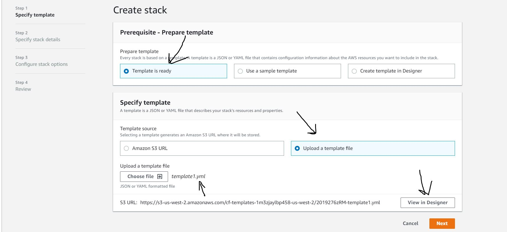

# Deployment Automation Lab
Team: @Bomibear, Fabian Brooks, Joachen Busch, Travis Cox, Renee Messick

[Deployment Troubleshooting]( https://github.com/rnmessick/cool-react-app/blob/master/otherReadmes/templateBugsFound.md)


deployed site: 	d2kqvfz045wwvs.cloudfront.net
## Setup
- Create a new directory named cool-react-app to hold your work for today.
- Run create-react-app cool-react-app to create a basic React app in your directory.
Ensure that you can run your React app locally.
- Connect your local repo to a new GitHub repo, and push your master branch.
- Install the @code-fellows/aws-tools from NPM

- Following the instructions, create a .env file and then generate an aws.yml file

```AWS_GITHUB_URL -- The URL to the repository at github containing your application
AWS_GITHUB_REPO -- The raw name of your repository
AWS_GITHUB_USER -- Your github login id
AWS_GITHUB_TOKEN -- A developer token from your github account that grants 'repo' access
AWS_APP -- Unique Name for your app at AWS
AWS_BUILD -- Unique Name for your build at AWS
AWS_BUCKET -- Unique Bucket Name where your website will be sourced at AWS
AWS_PROJECT -- Unique Name for your project at AWS
```

On the AWS console, create a new CloudFormation stack named coolReactApp

Upload the cloud formation template you created during setup

Attempt to deploy that CloudFormation stack.

Visit cloudfront, and view your React App via the public URL given to you.

Add, commit, push, make a PR, merge the PR.

See that your new code is automatically re-deployed and available at that URL


This project was bootstrapped with [Create React App](https://github.com/facebook/create-react-app).

## Available Scripts

In the project directory, you can run:

### `npm start`

Runs the app in the development mode.<br />
Open [http://localhost:3000](http://localhost:3000) to view it in the browser.

The page will reload if you make edits.<br />
You will also see any lint errors in the console.

### `npm test`

Launches the test runner in the interactive watch mode.<br />
See the section about [running tests](https://facebook.github.io/create-react-app/docs/running-tests) for more information.

### `npm run build`

Builds the app for production to the `build` folder.<br />
It correctly bundles React in production mode and optimizes the build for the best performance.

The build is minified and the filenames include the hashes.<br />
Your app is ready to be deployed!

See the section about [deployment](https://facebook.github.io/create-react-app/docs/deployment) for more information.

### `npm run eject`

**Note: this is a one-way operation. Once you `eject`, you can’t go back!**

If you aren’t satisfied with the build tool and configuration choices, you can `eject` at any time. This command will remove the single build dependency from your project.

Instead, it will copy all the configuration files and the transitive dependencies (Webpack, Babel, ESLint, etc) right into your project so you have full control over them. All of the commands except `eject` will still work, but they will point to the copied scripts so you can tweak them. At this point you’re on your own.

You don’t have to ever use `eject`. The curated feature set is suitable for small and middle deployments, and you shouldn’t feel obligated to use this feature. However we understand that this tool wouldn’t be useful if you couldn’t customize it when you are ready for it.

## Learn More

You can learn more in the [Create React App documentation](https://facebook.github.io/create-react-app/docs/getting-started).

To learn React, check out the [React documentation](https://reactjs.org/).

### Code Splitting

This section has moved here: https://facebook.github.io/create-react-app/docs/code-splitting

### Analyzing the Bundle Size

This section has moved here: https://facebook.github.io/create-react-app/docs/analyzing-the-bundle-size

### Making a Progressive Web App

This section has moved here: https://facebook.github.io/create-react-app/docs/making-a-progressive-web-app

### Advanced Configuration

This section has moved here: https://facebook.github.io/create-react-app/docs/advanced-configuration

### Deployment

This section has moved here: https://facebook.github.io/create-react-app/docs/deployment

### `npm run build` fails to minify

This section has moved here: https://facebook.github.io/create-react-app/docs/troubleshooting#npm-run-build-fails-to-minify
